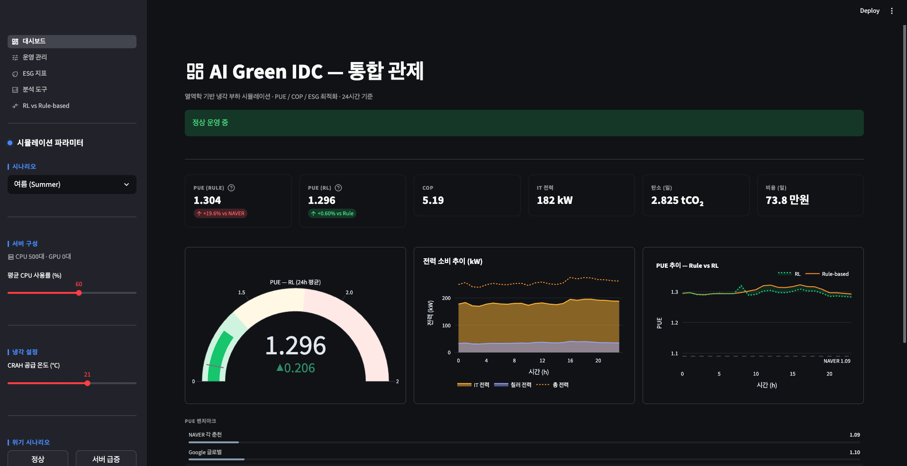
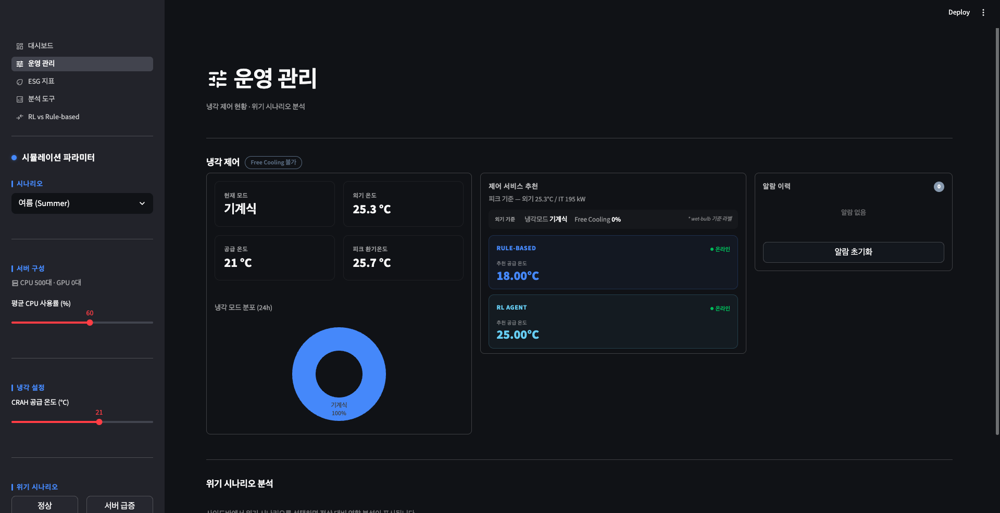
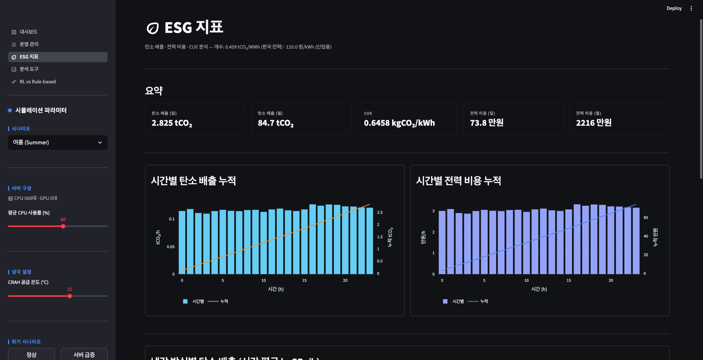
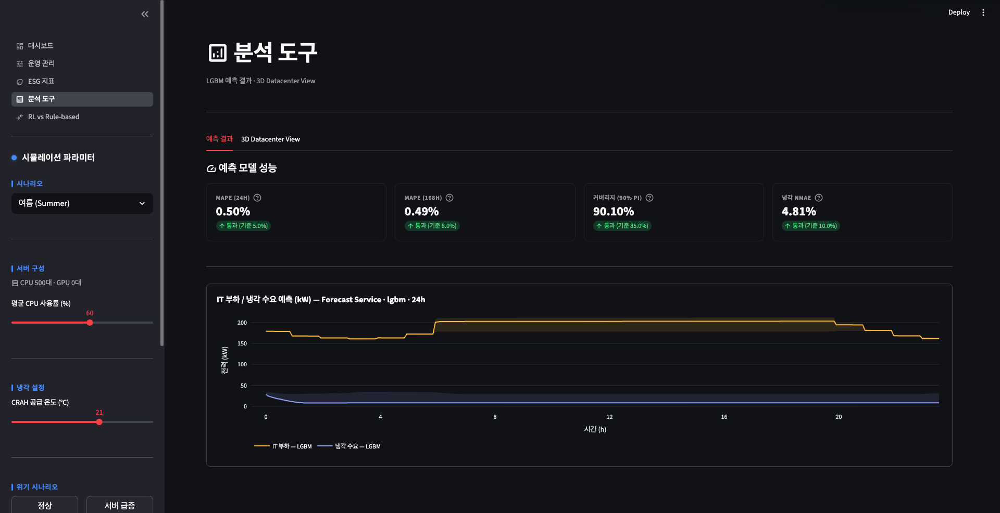
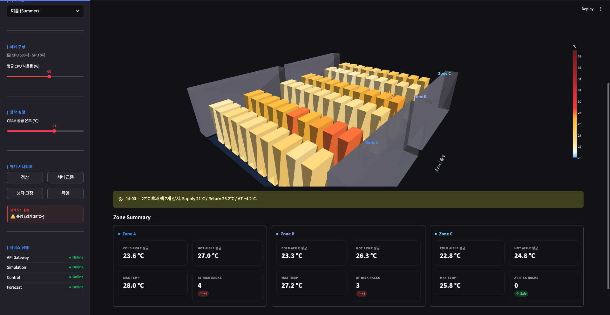
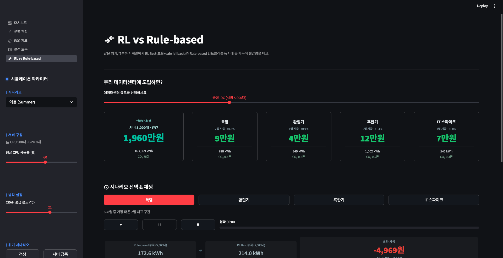
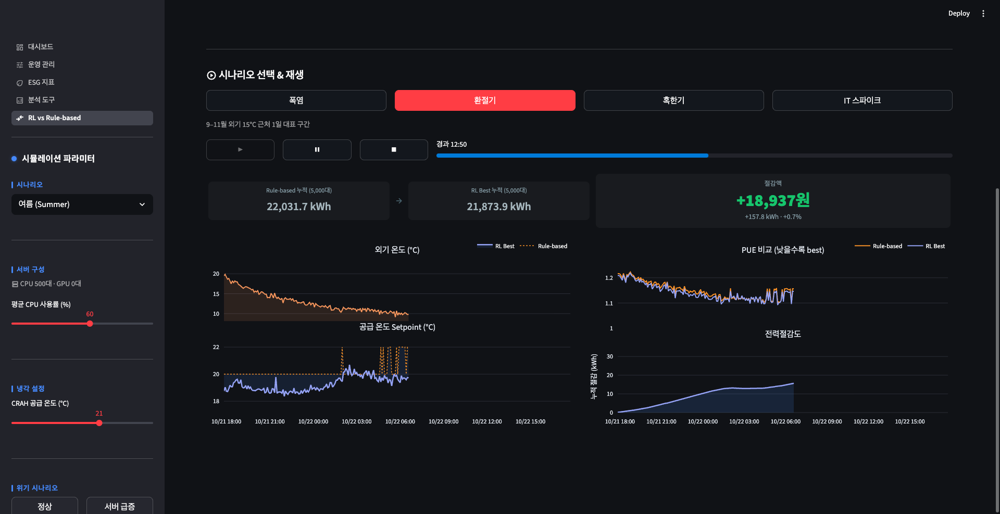
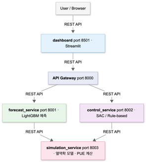

# AI Green IDC - 데이터센터 냉각 시스템 최적화

## 1. 프로젝트 개요

본 프로젝트는 데이터센터 냉각의 에너지 효율을 최적화하는 **강화학습 기반 통합 제어 시스템**이다. LightGBM으로 IT 부하와 냉각 수요를 예측하고, 자체 구축한 열역학 시뮬레이션 환경 위에서 SAC 에이전트가 CRAH 공급 온도를 동적으로 제어해 PUE를 절감한다.

> **실험 결과**: Rule-based 대비 **PUE 7.8% 절감 (1.1894 → 1.1747)** · 온도 위반율 **0%** · IT 부하 예측 MAPE **0.50%** · 폭염 48시간 시나리오 검증 완료

## 목차

- [1. 프로젝트 개요](#1-프로젝트-개요)
- [2. 시연 영상 (YouTube)](#2-시연-영상-youtube)
- [3. 대시보드 미리보기](#3-대시보드-미리보기)
- [4. 팀 소개](#4-팀-소개)
- [5. 프로젝트 실행](#5-프로젝트-실행)
- [6. 프로젝트 상세 내용](#6-프로젝트-상세-내용)
- [7. 데이터 출처](#7-데이터-출처)

## 2. 시연 영상 (YouTube)

[](https://youtu.be/NLvnjkAnINI)

> - 사이드바·페이지 구성 소개
> - 사이드바 조작에 따른 실시간 KPI 반응
> - LightGBM 24시간 예측 + 3D 데이터센터 뷰
> - RL Best vs Rule-based 폭염 시나리오 라이브 비교
> - ROI 계산기 및 기대 효과 환산

## 3. 대시보드 미리보기

| 페이지 | 설명 | 스크린샷 |
|---|---|---|
| **0_대시보드** | 종합 KPI · PUE 게이지 · 전력 추이 · 벤치마크 |  |
| **1_운영_관리** | 냉각 모드 제어 · Rule/RL 제어 추천 · 위기 시나리오 분석 |  |
| **2_ESG_지표** | 탄소 배출 · 전력 비용 · CUE · ROI 계산기 |  |
| **3_분석_도구** | LightGBM 24h 예측 + 90% PI · 3D 데이터센터 뷰 |   |
| **4_RL_vs_Rulebased** | RL Best와 Rule-based 라이브 비교 · 누적 절감 카운터 |   |

<!-- TODO: docs/screenshots/ 디렉토리에 위 파일명으로 PNG 추가 (권장 해상도 1920×1080) -->

## 4. 팀 소개

팀명: 짱돌

| **팀원** | **학번** | **담당 역할** |
| --- | --- | --- |
| **김효림 (팀장)** | 20221549 | • 제어 스키마 설계 및 Control Service 구축<br>• 커스텀 RL 환경 구현<br>• PPO/SAC 학습 파이프라인 구현<br>• 베이스라인 평가 프레임워크 구축<br>• RL 학습 전반 총괄 |
| **심하연** | 20221573 | • MSA 설계 및 Docker 환경 구성<br>• Streamlit 대시보드 프론트엔드 구현 및 API 연동<br>• RL 학습<br>• 커스텀 보상 함수 보완 |
| **김다은** | 20231515 | • Forecast Service 스키마 설계 및 구축<br>• LightGBM 기반 IT 부하·냉각 수요 예측 모델 구현<br>• RL 학습 |
| **김성현** | 20201564 | • 열역학 모델 구현 및 검증<br>• PID 시뮬레이터 구현<br>• 데이터 물리학적 검증<br>• RL 학습 |
| **심서연** | 20221571 | • 데이터 수집 및 전처리<br>• 데이터 파이프라인 구축 및 파생변수<br>• 모델 비교용 이동평균 예측 모델 구현<br>• RL 학습 |

## 5. 프로젝트 실행

```bash
# 가상환경 생성 및 패키지 설치
Green-IDC-Optimizer$ uv venv
Green-IDC-Optimizer$ source .venv/bin/activate
Green-IDC-Optimizer$ uv sync

# 전체 실행
Green-IDC-Optimizer$ docker compose up --build
# 백그라운드 전체 실행
Green-IDC-Optimizer$ docker compose up -d --build
# 전체 종료
Green-IDC-Optimizer$ docker compose down
```

### 서비스 포트

실행 후 다음 포트로 접속:

| 포트 | 서비스 | 비고 |
|---|---|---|
| **8501** | Streamlit Dashboard | 메인 진입점 — http://localhost:8501 |
| **8000** | API Gateway | 라우팅 |
| **8001** | Forecast Service | LightGBM 예측 |
| **8002** | Control Service | SAC / Rule-based 제어 |
| **8003** | Simulation Service | 열역학 모델 |

→ 자세한 내용은 [docs/RUNBOOK.md](docs/RUNBOOK.md) 파일 참고

## 6. 프로젝트 상세 내용



### 6-1. 기술 스택

#### **6-1-1. Backend / API**

- Python 3.11 (uv 패키지 매니저)
- FastAPI + Uvicorn - API Gateway, Forecast/Control/Simulation 서비스
- Pydantic - 요청/응답 Schema

#### **6-1-2. ML / AI**

- **자체 IDCEnv (커스텀 Gymnasium 환경)** - 1차 ODE 기반 열역학 모델 + 5분 step 시뮬레이션 (Sinergym 비교 실험 후 학습 속도·커스터마이징 자유도를 위해 자체 구현 채택)
- **LightGBM** - 주력 예측 모델, Quantile 회귀로 90% Prediction Interval 산출
- **PyTorch** - LSTM 비교용 (선택적)
- **Stable-Baselines3** - SAC 강화학습 에이전트
- **Gymnasium** - RL 환경 인터페이스
- **Scikit-learn** - 스케일러·전처리

#### **6-1-3. Frontend / 시각화**

- Streamlit - 대시보드
- Plotly / Altair - 차트

#### **6-1-4. 인프라**

- Docker + Docker Compose - 마이크로서비스 컨테이너화
- Pandas, Numpy - 데이터 전처리

### 6-2. 프로젝트 상세

#### 6-2-1. 열역학 기반 냉각 부하 모델

**`domain/thermodynamics/`**

- **SPECpower_ssj2008 기반 서버 전력 모델**: `P = P_idle + (P_max - P_idle) × cpu_util` (CPU서버: idle 200W / max 500W, GPU서버: idle 300W / max 1500W)
- **냉각 부하 계산**: `Q = ṁ × cp × ΔT` 직접 구현
- **칠러 COP 모델**: 외기온도 + 공급온도 + 부분부하율(PLR) 기반 비선형 효율 모델
- **습구온도 기반 냉각 모드 자동 전환**: Free Cooling(습구 <10°C) / Hybrid(10~18°C) / Chiller(>18°C)
- **PUE 계산**: 구글 데이터센터 PUE 1.10 벤치마크 기준

#### 6-2-2. IT 부하 / 냉각 수요 예측

**`domain/forecasting/`**

- **LightGBM**: lag feature + rolling 통계 + 캘린더 특성, 24h/168h ahead 예측
- 출력: 예측값 + **90% 신뢰구간**

#### 6-2-3. RL 기반 냉각 제어

**`domain/controllers/`**

- **커스텀 IDC Gym 환경** (`idc_env.py`): 실측 Google Cluster Trace 2019 + 기상청 ASOS 데이터 기반 (365일 × 288스텝)
- **관측 공간**: 9차원 (시간, 외기온도, 습도, CPU 사용률, 존 온도, 공급온도, IT전력, 습구온도 등)
- **행동 공간**: 공급온도 설정값 [18, 25]°C
- **알고리즘**: SAC (Soft Actor-Critic), PPO 비교 실험 후 채택 (Stable-Baselines3)
- **도메인 랜덤화**: 학습 중 위기 시나리오 자동 주입 — 서버급증(CPU ×1.3) / 폭염(외기 +5~10°C) / 칠러 효율 저하
- **2-tier 안전 시스템**: RL 추론 + 존 온도 26.5°C 초과 시 강제 냉각 fallback
- **Rule-based 컨트롤러** + **PID 제어기** (Anti-windup, Incremental PID) 구현

#### 6-2-4. 통합 관제 대시보드

**`apps/dashboard/`**

- **실시간 대시보드**: PUE 게이지, 온도, 전력 KPI
- **운영 관리**: 파라미터 조작 → 24h 시뮬레이션 즉시 실행
- **ESG 지표**: 탄소 배출량 (0.459 tCO₂/MWh), WUE, 에너지 비용
- **분석 도구**: 예측 모델 성능 비교, feature importance
- **RL vs Rule-based**: 두 제어 방식 PUE/온도 위반율 비교

#### 6-2-5. 위기 시나리오 시뮬레이터

- 상황 1 ) 서버 급증: IT 부하 +30%
- 상황 2 ) 칠러 고장: 냉각 용량 50% 저하
- 상황 3 ) 폭염: 외기 38°C 이상

#### 6-2-6. 정량 성과

| 지표 | 목표 | 달성 |
|---|---|---|
| IT 부하 예측 MAPE (24h) | 5% 이내 | **0.50%** |
| 냉각 수요 예측 MAPE (24h) | 5% 이내 | **3.91%** |
| 90% PI Coverage (IT / 냉각) | 85% 이상 | **90.10% / 94.41%** |
| PUE 개선율 (Rule-based 대비) | best-effort | **7.8%** (1.1894 → 1.1747) |
| RL 온도 위반율 | best-effort | **0%** |
| 위기 시나리오 27°C 이하 유지 | — | 달성 |

## 7. 데이터 출처

본 프로젝트는 다음 공개 데이터셋을 기반으로 합성 1년치 시뮬 데이터를 구축했습니다.

| 데이터 | 출처 | 활용 |
|---|---|---|
| **Google Cluster Trace 2019** | [google/cluster-data](https://github.com/google/cluster-data) | CPU 사용률 패턴 (시간별 부하 일주기) |
| **기상청 ASOS** | [data.kma.go.kr](https://data.kma.go.kr/) | 외기 dry-bulb 온도, 상대습도, 풍속 |
| **SPECpower_ssj2008** | [spec.org/power_ssj2008](https://www.spec.org/power_ssj2008/) | 서버 전력 모델 (idle / max 전력) |
| **한전 산업용 전기요금** | 한국전력공사 산업용(갑) 평균 | 120원/kWh (ESG·ROI 계산용) |
| **한국 전력 탄소 배출계수** | 환경부 온실가스 배출계수 | 0.459 kgCO₂/kWh |
| **NAVER 각 춘천 PUE** | 공개 보도자료 | 1.09 (효율 벤치마크) |

> 합성 데이터셋(`data/weather/synthetic_idc_1year_noisy.parquet`)은 위 출처를 조합·재가공한 결과이며, 1년치 5분 간격(105,120 step) 데이터로 RL 학습·예측 모델 학습·시뮬에 동일하게 사용.
